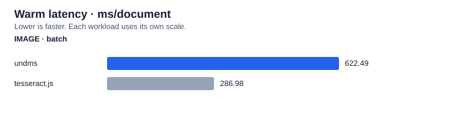
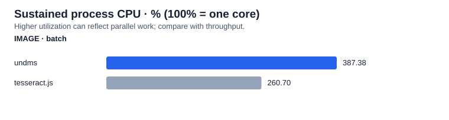

## Package extraction benchmark

3 sourced documents across IMAGE. 3 isolated process rounds per package/workload on Apple M1 (8 logical CPUs).

**Warm time per document, milliseconds — lower is faster.** Each single-file median is weighted equally; batches contain distinct documents and report amortized cost. Unsupported formats are shown as —; incomplete measurements are not ranked.

| Format / mode  |  undms | tesseract.js |
| -------------- | -----: | -----------: |
| IMAGE · single | 576.90 |       634.14 |
| IMAGE · batch  | 622.49 |       286.98 |

Unique warm-latency group wins: undms 1, tesseract.js 1 across 2 complete comparisons. Ties are excluded; small differences do not establish statistical significance.

Compared with undms, 0 measured competitor rounds have identical text, 0 differ only in whitespace, and 12 differ beyond whitespace. These comparisons are not ground-truth accuracy scores. Review the saved extracted text. This small corpus does not establish general performance, extraction accuracy, or metadata equivalence.

### Image OCR accuracy

undms uses ocrs in **balanced** mode; Tesseract.js uses English LSTM (OEM 1), the pinned best_int model, and reused workers (up to 4, bounded by image count). Native OCR uses its dedicated serial lane. Models are prepared before timing; first recognition includes engine initialization. Warm timing excludes worker creation and final termination.

| Receipt   | Engine       | Character error % | Word error % |
| --------- | ------------ | ----------------: | -----------: |
| sroie-000 | undms        |             54.02 |        75.29 |
| sroie-000 | tesseract.js |             16.70 |        48.24 |
| sroie-001 | undms        |             39.77 |        60.78 |
| sroie-001 | tesseract.js |             23.98 |        43.14 |
| sroie-002 | undms        |             34.02 |        61.79 |
| sroie-002 | tesseract.js |              4.70 |        22.76 |

Lower error rates are better. Scores use the first single-image output from round 1, normalized with NFKC, lowercase and collapsed whitespace. Levenshtein edits are divided by reference characters or words; insertions can produce rates above 100%. Reference text follows SROIE annotation order, so layout order and annotation errors affect scores. Three receipts do not establish general OCR accuracy. [Pinned images and reference annotations](../../image-corpus-manifest.json).

**CPU is measured separately under sustained load**, using OS process user + system counters, including native threads. 100% means one occupied core, not the whole machine. More CPU utilization can reflect useful parallel work; compare it with completed documents/s and CPU time/document.

0 failed runs. [CPU, memory and methodology](report.md) · [Raw measurements](results.json)

Environment and measurement method

Measured 2026-10-04T10:47:32.865Z with Node v24.21.0 on darwin-arm64; Apple M1, 8 logical CPUs, 8.00 GiB RAM. Commit 7055761231f197a210b5ce81af79509a3f71041b (dirty workspace).

Versions: officeparser 8.1.0, mammoth 1.13.0, pdf-parse 2.4.5, tesseract.js 7.0.0, tinybench 6.2.0, undms workspace. 3 rounds; Tinybench warm measurement 1000 ms, sustained resource measurement 2000 ms, batch concurrency 4. Warm medians pool timing samples per workload across rounds; single-file workload medians are equally weighted within each format. Batch call time is divided by document count, so it is amortized ms/document. Cold extraction and module load are reported separately below.

CPU uses OS process user + system counters during sustained extraction, wall-time weighted across runs: 100% is one logical core and values can exceed 100%. Host capacity is this process CPU divided by logical CPU count, not total system-wide utilization. Throughput is total completed documents divided by measured wall time. Peak RSS is the OS process high-water mark across module load, latency and resource phases; retained RSS/heap are means after GC while inputs and first/last results remain retained. The resource loop yields once per completed call and includes adapter/cleanup and monitoring overhead. The 100 ms CPU timeline may be delayed by synchronous blocking; aggregate CPU remains measured by OS counters. Idle CPU is measured over 300 ms after a 200 ms settling period. This is a short recovery check, not proof of leak freedom. Failed/incomplete measurements carry † and cannot win. Async adapters are awaited through completion.

## Sustained CPU

Resource measurements by format and package

| Format / mode  | Package      | Process CPU % | Host capacity % | CPU ms/doc | docs/s | Peak RSS MiB | After-GC RSS MiB | After-GC heap MiB | Idle CPU % |
| -------------- | ------------ | ------------: | --------------: | ---------: | -----: | -----------: | ---------------: | ----------------: | ---------: |
| IMAGE · single | undms        |        384.48 |           48.06 |    2250.75 |   1.71 |       384.83 |           342.76 |              6.52 |       0.10 |
| IMAGE · single | tesseract.js |        100.87 |           12.61 |     633.20 |   1.59 |       208.22 |           185.65 |              6.54 |       0.10 |
| IMAGE · batch  | undms        |        387.38 |           48.42 |    2400.66 |   1.61 |       379.23 |           358.11 |              6.55 |       0.07 |
| IMAGE · batch  | tesseract.js |        260.70 |           32.59 |     754.86 |   3.45 |       350.52 |           295.97 |              6.60 |       0.10 |

Per-file and batch timings, cold starts and output lengths

### SROIE receipt 000

image / single; 1 documents: sroie-000.
| Package | Round | Warm p50 ms/call | Cold ms | Load ms | Output UTF-16 units |
| --- | ---: | ---: | ---: | ---: | --- |
| undms | 0 | 515.13 | 506.25 | 313.71 | 528 |
| tesseract.js | 0 | 517.45 | 730.37 | 7.30 | 499 |
| tesseract.js | 1 | 517.59 | 731.36 | 4.67 | 499 |
| undms | 1 | 510.90 | 541.87 | 8.50 | 528 |
| undms | 2 | 530.39 | 495.80 | 4.09 | 528 |
| tesseract.js | 2 | 516.30 | 730.95 | 7.30 | 499 |

### SROIE receipt 001

image / single; 1 documents: sroie-001.
| Package | Round | Warm p50 ms/call | Cold ms | Load ms | Output UTF-16 units |
| --- | ---: | ---: | ---: | ---: | --- |
| undms | 0 | 546.65 | 498.91 | 4.52 | 550 |
| tesseract.js | 0 | 652.20 | 867.23 | 7.39 | 612 |
| tesseract.js | 1 | 654.45 | 874.75 | 4.41 | 612 |
| undms | 1 | 537.19 | 536.72 | 8.07 | 550 |
| undms | 2 | 566.89 | 540.91 | 4.48 | 550 |
| tesseract.js | 2 | 653.21 | 870.04 | 6.94 | 612 |

### SROIE receipt 002

image / single; 1 documents: sroie-002.
| Package | Round | Warm p50 ms/call | Cold ms | Load ms | Output UTF-16 units |
| --- | ---: | ---: | ---: | ---: | --- |
| undms | 0 | 683.45 | 935.47 | 8.25 | 709 |
| tesseract.js | 0 | 732.52 | 979.46 | 7.04 | 734 |
| tesseract.js | 1 | 733.48 | 949.34 | 7.19 | 734 |
| undms | 1 | 638.93 | 619.54 | 8.25 | 709 |
| undms | 2 | 667.55 | 619.42 | 4.42 | 709 |
| tesseract.js | 2 | 731.59 | 1005.64 | 8.88 | 734 |

### IMAGE inbox (3 unique documents)

image / batch; 3 documents: sroie-000, sroie-001, sroie-002.
| Package | Round | Warm p50 ms/call | Cold ms | Load ms | Output UTF-16 units |
| --- | ---: | ---: | ---: | ---: | --- |
| undms | 0 | 1815.22 | 1704.81 | 5.49 | 528, 550, 709 |
| tesseract.js | 0 | 856.27 | 1120.89 | 7.76 | 499, 612, 734 |
| tesseract.js | 1 | 853.39 | 1096.13 | 4.51 | 499, 612, 734 |
| undms | 1 | 1855.25 | 1775.26 | 8.54 | 528, 550, 709 |
| undms | 2 | 1915.51 | 1870.91 | 4.78 | 528, 550, 709 |
| tesseract.js | 2 | 876.98 | 1158.08 | 8.08 | 499, 612, 734 |

## Corpus and provenance

- **SROIE receipt 000** (sroie-000, image, 98120 bytes): [source](https://github.com/zzzDavid/ICDAR-2019-SROIE), license ICDAR2019 SROIE source terms; cached images not redistributed. Local path: ../../corpus-cache/sroie-000-8b85d2c325c68579.image. SHA-256: 8b85d2c325c68579b53446177602709a8f8faeeec710912f62b6ad369234887c. Expected markers: .
- **SROIE receipt 001** (sroie-001, image, 85804 bytes): [source](https://github.com/zzzDavid/ICDAR-2019-SROIE), license ICDAR2019 SROIE source terms; cached images not redistributed. Local path: ../../corpus-cache/sroie-001-4e7bb7f427732e76.image. SHA-256: 4e7bb7f427732e769eafc6f6eed5a92eedccf96bc0c711f46466462b98916c73. Expected markers: .
- **SROIE receipt 002** (sroie-002, image, 124971 bytes): [source](https://github.com/zzzDavid/ICDAR-2019-SROIE), license ICDAR2019 SROIE source terms; cached images not redistributed. Local path: ../../corpus-cache/sroie-002-c5995745cc13c857.image. SHA-256: c5995745cc13c8570fe0914567124d65e29df3ea4dd91713badb9e7217bc2db1. Expected markers: .

## Failures

No failed runs.

## OCR worker cleanup

Warm resource measurements retain reusable workers and models. Tesseract workers are then terminated before the idle check; native models remain process cached. Post-termination RSS includes retained inputs/results and allocator pages and is not a leak verdict.

| Workload         | Package      | Round | Termination + GC ms | RSS after termination MiB |
| ---------------- | ------------ | ----: | ------------------: | ------------------------: |
| single-sroie-000 | tesseract.js |     0 |                1.90 |                    199.59 |
| single-sroie-000 | tesseract.js |     1 |                1.45 |                    197.97 |
| single-sroie-000 | tesseract.js |     2 |                1.46 |                    204.45 |
| single-sroie-001 | tesseract.js |     0 |                1.87 |                    129.31 |
| single-sroie-001 | tesseract.js |     1 |                1.64 |                    204.92 |
| single-sroie-001 | tesseract.js |     2 |                1.48 |                    206.66 |
| single-sroie-002 | tesseract.js |     0 |                1.46 |                    116.48 |
| single-sroie-002 | tesseract.js |     1 |                1.50 |                    196.64 |
| single-sroie-002 | tesseract.js |     2 |                1.56 |                    198.27 |
| batch-image      | tesseract.js |     0 |                1.53 |                    339.81 |
| batch-image      | tesseract.js |     1 |                1.49 |                    349.13 |
| batch-image      | tesseract.js |     2 |                1.61 |                    194.38 |
