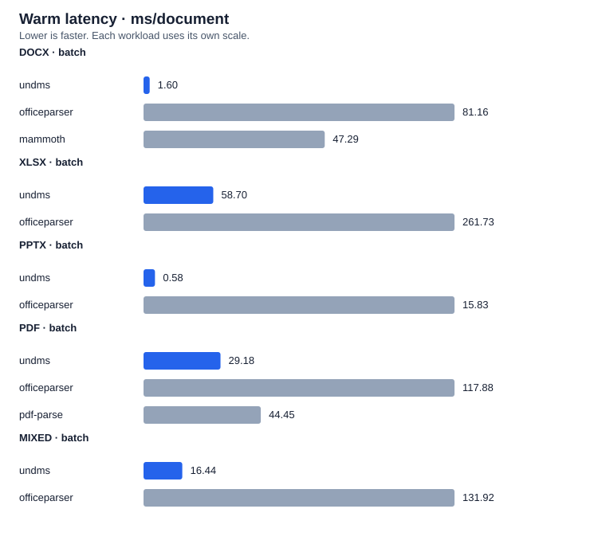
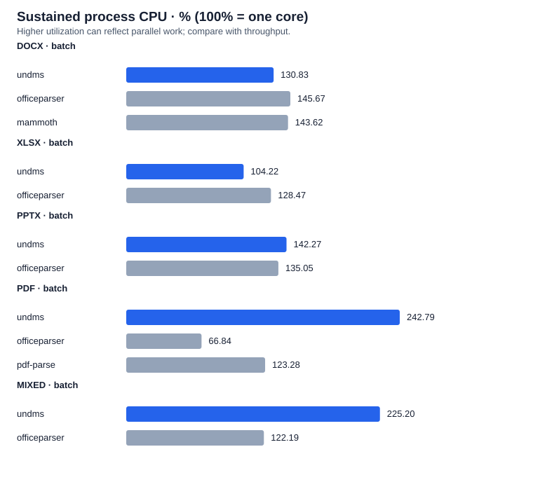

## Package extraction benchmark

8 sourced documents across DOCX, XLSX, PPTX, PDF. 3 isolated process rounds per package/workload on Apple M1 (8 logical CPUs).

**Warm time per document, milliseconds — lower is faster.** Each single-file median is weighted equally; batches contain distinct documents and report amortized cost. Unsupported formats are shown as —; incomplete measurements are not ranked.

| Format / mode | undms | officeparser | mammoth | pdf-parse |
| ------------- | ----: | -----------: | ------: | --------: |
| DOCX · single |  2.04 |        79.31 |   45.48 |         — |
| XLSX · single | 61.56 |       278.41 |       — |         — |
| PPTX · single |  0.74 |        14.39 |       — |         — |
| PDF · single  | 37.34 |       165.73 |       — |     44.39 |
| DOCX · batch  |  1.60 |        81.16 |   47.29 |         — |
| XLSX · batch  | 58.70 |       261.73 |       — |         — |
| PPTX · batch  |  0.58 |        15.83 |       — |         — |
| PDF · batch   | 29.18 |       117.88 |       — |     44.45 |
| MIXED · batch | 16.44 |       131.92 |       — |         — |

Unique warm-latency group wins: undms 9 across 9 complete comparisons. Ties are excluded; small differences do not establish statistical significance.

Compared with undms, 0 measured competitor rounds have identical text, 3 differ only in whitespace, and 54 differ beyond whitespace. These comparisons are not ground-truth accuracy scores. Review the saved extracted text. This small corpus does not establish general performance, extraction accuracy, or metadata equivalence.

**CPU is measured separately under sustained load**, using OS process user + system counters, including native threads. 100% means one occupied core, not the whole machine. More CPU utilization can reflect useful parallel work; compare it with completed documents/s and CPU time/document.

0 failed runs. [CPU, memory and methodology](report.md) · [Raw measurements](results.json)

Environment and measurement method

Measured 2026-10-04T09:56:50.077Z with Node v24.21.0 on darwin-arm64; Apple M1, 8 logical CPUs, 8.00 GiB RAM. Commit 7055761231f197a210b5ce81af79509a3f71041b (dirty workspace).

Versions: officeparser 8.1.0, mammoth 1.13.0, pdf-parse 2.4.5, tinybench 6.2.0, undms workspace. 3 rounds; Tinybench warm measurement 1000 ms, sustained resource measurement 2000 ms, batch concurrency 4. Warm medians pool timing samples per workload across rounds; single-file workload medians are equally weighted within each format. Batch call time is divided by document count, so it is amortized ms/document. Cold extraction and module load are reported separately below.

CPU uses OS process user + system counters during sustained extraction, wall-time weighted across runs: 100% is one logical core and values can exceed 100%. Host capacity is this process CPU divided by logical CPU count, not total system-wide utilization. Throughput is total completed documents divided by measured wall time. Peak RSS is the OS process high-water mark across module load, latency and resource phases; retained RSS/heap are means after GC while inputs and first/last results remain retained. The resource loop yields once per completed call and includes adapter/cleanup and monitoring overhead. The 100 ms CPU timeline may be delayed by synchronous blocking; aggregate CPU remains measured by OS counters. Idle CPU is measured over 300 ms after a 200 ms settling period. This is a short recovery check, not proof of leak freedom. Failed/incomplete measurements carry † and cannot win. Async adapters are awaited through completion.

## Sustained CPU

Resource measurements by format and package

| Format / mode | Package      | Process CPU % | Host capacity % | CPU ms/doc |  docs/s | Peak RSS MiB | After-GC RSS MiB | After-GC heap MiB | Idle CPU % |
| ------------- | ------------ | ------------: | --------------: | ---------: | ------: | -----------: | ---------------: | ----------------: | ---------: |
| DOCX · single | undms        |        103.24 |           12.91 |       1.52 |  677.94 |        91.16 |            87.45 |              6.74 |       0.09 |
| DOCX · single | officeparser |        137.10 |           17.14 |      73.90 |   18.55 |       462.48 |           396.91 |             15.31 |       0.10 |
| DOCX · single | mammoth      |        126.72 |           15.84 |      39.03 |   32.46 |       293.41 |           229.54 |             10.01 |       0.08 |
| XLSX · single | undms        |        100.86 |           12.61 |       9.27 |  108.77 |       128.34 |           101.80 |              8.33 |       0.09 |
| XLSX · single | officeparser |        130.58 |           16.32 |      57.47 |   22.72 |       556.64 |           434.33 |             16.23 |       0.12 |
| PPTX · single | undms        |        106.76 |           13.35 |       0.75 | 1427.06 |       101.53 |            95.22 |              6.59 |       0.09 |
| PPTX · single | officeparser |        151.87 |           18.98 |      21.22 |   71.57 |       374.66 |           356.58 |             15.30 |       0.11 |
| PDF · single  | undms        |        185.77 |           23.22 |      64.92 |   28.62 |       101.03 |            99.65 |              6.74 |       0.11 |
| PDF · single  | officeparser |         47.73 |            5.97 |      75.81 |    6.30 |       385.03 |           330.65 |             40.00 |       0.25 |
| PDF · single  | pdf-parse    |        129.98 |           16.25 |      61.97 |   20.98 |       439.30 |           399.36 |             24.37 |       0.20 |
| DOCX · batch  | undms        |        130.83 |           16.35 |       2.13 |  613.25 |        93.06 |            92.06 |              6.79 |       0.09 |
| DOCX · batch  | officeparser |        145.67 |           18.21 |     122.95 |   11.85 |       464.94 |           436.26 |             15.14 |       0.07 |
| DOCX · batch  | mammoth      |        143.62 |           17.95 |      73.91 |   19.43 |       313.30 |           240.39 |              9.53 |       0.04 |
| XLSX · batch  | undms        |        104.22 |           13.03 |      61.85 |   16.85 |       141.56 |           124.19 |             10.07 |       0.11 |
| XLSX · batch  | officeparser |        128.47 |           16.06 |     350.09 |    3.67 |       557.34 |           444.38 |             17.51 |       0.12 |
| PPTX · batch  | undms        |        142.27 |           17.78 |       0.84 | 1685.09 |       106.13 |           105.35 |              6.61 |       0.11 |
| PPTX · batch  | officeparser |        135.05 |           16.88 |      22.62 |   59.71 |       392.95 |           390.29 |             15.23 |       0.10 |
| PDF · batch   | undms        |        242.79 |           30.35 |      72.84 |   33.33 |       111.31 |           110.65 |              6.87 |       0.12 |
| PDF · batch   | officeparser |         66.84 |            8.35 |      78.69 |    8.49 |       376.33 |           369.43 |             40.34 |       0.25 |
| PDF · batch   | pdf-parse    |        123.28 |           15.41 |      58.84 |   20.95 |       371.52 |           369.90 |             24.54 |       0.10 |
| MIXED · batch | undms        |        225.20 |           28.15 |      37.85 |   59.50 |       170.78 |           158.19 |              9.02 |       0.11 |
| MIXED · batch | officeparser |        122.19 |           15.27 |     169.54 |    7.21 |       600.27 |           500.30 |             44.99 |       0.42 |

Per-file and batch timings, cold starts and output lengths

### Sewage discharge consultation

docx / single; 1 documents: sewage-consultation.
| Package | Round | Warm p50 ms/call | Cold ms | Load ms | Output UTF-16 units |
| --- | ---: | ---: | ---: | ---: | --- |
| undms | 0 | 3.14 | 5.40 | 377.70 | 32356 |
| officeparser | 0 | 127.84 | 282.54 | 80.69 | 35368 |
| mammoth | 0 | 72.91 | 125.06 | 61.82 | 32713 |
| officeparser | 1 | 126.38 | 221.79 | 71.13 | 35368 |
| mammoth | 1 | 71.70 | 127.19 | 31.09 | 32713 |
| undms | 1 | 3.17 | 6.25 | 8.26 | 32356 |
| mammoth | 2 | 73.86 | 127.31 | 32.19 | 32713 |
| undms | 2 | 3.15 | 3.44 | 3.95 | 32356 |
| officeparser | 2 | 125.81 | 219.23 | 46.53 | 35368 |

### Sewage discharge risk assessment

docx / single; 1 documents: sewage-risk.
| Package | Round | Warm p50 ms/call | Cold ms | Load ms | Output UTF-16 units |
| --- | ---: | ---: | ---: | ---: | --- |
| undms | 0 | 0.96 | 1.18 | 3.95 | 18779 |
| officeparser | 0 | 31.15 | 101.44 | 48.44 | 18917 |
| mammoth | 0 | 18.25 | 50.31 | 59.72 | 18975 |
| officeparser | 1 | 31.01 | 100.04 | 47.08 | 18917 |
| mammoth | 1 | 18.26 | 50.92 | 30.95 | 18975 |
| undms | 1 | 0.93 | 3.36 | 9.33 | 18779 |
| mammoth | 2 | 18.78 | 51.03 | 30.59 | 18975 |
| undms | 2 | 0.95 | 1.17 | 4.07 | 18779 |
| officeparser | 2 | 31.87 | 117.10 | 76.92 | 18917 |

### Departmental public spending budgets

xlsx / single; 1 documents: public-budgets.
| Package | Round | Warm p50 ms/call | Cold ms | Load ms | Output UTF-16 units |
| --- | ---: | ---: | ---: | ---: | --- |
| undms | 0 | 4.71 | 5.84 | 4.45 | 54320 |
| officeparser | 0 | 20.92 | 85.69 | 47.51 | 52695 |
| officeparser | 1 | 21.47 | 88.31 | 50.80 | 52695 |
| undms | 1 | 4.73 | 7.13 | 8.31 | 54320 |
| undms | 2 | 4.80 | 5.17 | 4.04 | 54320 |
| officeparser | 2 | 20.99 | 100.40 | 80.45 | 52695 |

### Deaths by age, sex and deprivation 1991–2024

xlsx / single; 1 documents: mortality-data.
| Package | Round | Warm p50 ms/call | Cold ms | Load ms | Output UTF-16 units |
| --- | ---: | ---: | ---: | ---: | --- |
| undms | 0 | 118.88 | 123.46 | 4.68 | 465745 |
| officeparser | 0 | 543.04 | 760.55 | 52.55 | 465200 |
| officeparser | 1 | 527.67 | 718.08 | 93.64 | 465200 |
| undms | 1 | 118.43 | 121.68 | 8.19 | 465745 |
| undms | 2 | 117.09 | 117.56 | 4.91 | 465745 |
| officeparser | 2 | 532.71 | 683.27 | 72.84 | 465200 |

### Satellites and seawater teaching slides

pptx / single; 1 documents: satellites-slides.
| Package | Round | Warm p50 ms/call | Cold ms | Load ms | Output UTF-16 units |
| --- | ---: | ---: | ---: | ---: | --- |
| undms | 0 | 0.55 | 3.44 | 7.93 | 1301 |
| officeparser | 0 | 8.62 | 63.00 | 88.14 | 2889 |
| officeparser | 1 | 8.42 | 50.87 | 47.71 | 2889 |
| undms | 1 | 0.55 | 1.14 | 4.68 | 1301 |
| undms | 2 | 0.57 | 1.38 | 4.68 | 1301 |
| officeparser | 2 | 8.55 | 51.94 | 48.97 | 2889 |

### Procurement Act training webinar

pptx / single; 1 documents: procurement-slides.
| Package | Round | Warm p50 ms/call | Cold ms | Load ms | Output UTF-16 units |
| --- | ---: | ---: | ---: | ---: | --- |
| undms | 0 | 0.92 | 1.41 | 4.14 | 5897 |
| officeparser | 0 | 20.23 | 67.27 | 46.93 | 6434 |
| officeparser | 1 | 20.35 | 69.04 | 48.02 | 6434 |
| undms | 1 | 0.91 | 1.36 | 4.05 | 5897 |
| undms | 2 | 0.92 | 1.51 | 4.80 | 5897 |
| officeparser | 2 | 20.03 | 76.77 | 72.32 | 6434 |

### Planning applications statistical report

pdf / single; 1 documents: planning-report.
| Package | Round | Warm p50 ms/call | Cold ms | Load ms | Output UTF-16 units |
| --- | ---: | ---: | ---: | ---: | --- |
| undms | 0 | 48.38 | 50.99 | 4.05 | 55067 |
| officeparser | 0 | 202.68 | 1002.40 | 48.24 | 56985 |
| pdf-parse | 0 | 55.54 | 132.84 | 159.42 | 54175 |
| officeparser | 1 | 195.17 | 624.36 | 50.03 | 56985 |
| pdf-parse | 1 | 55.66 | 147.96 | 194.74 | 54175 |
| undms | 1 | 48.50 | 54.07 | 7.74 | 55067 |
| pdf-parse | 2 | 55.51 | 138.83 | 168.94 | 54175 |
| undms | 2 | 48.08 | 48.91 | 3.91 | 55067 |
| officeparser | 2 | 204.86 | 684.64 | 71.78 | 56985 |

### Planning statistics technical notes

pdf / single; 1 documents: planning-notes.
| Package | Round | Warm p50 ms/call | Cold ms | Load ms | Output UTF-16 units |
| --- | ---: | ---: | ---: | ---: | --- |
| undms | 0 | 26.45 | 26.96 | 4.44 | 31452 |
| officeparser | 0 | 130.77 | 599.94 | 86.08 | 39252 |
| pdf-parse | 0 | 32.98 | 107.86 | 160.69 | 31094 |
| officeparser | 1 | 132.66 | 529.69 | 46.65 | 39252 |
| pdf-parse | 1 | 33.16 | 104.69 | 146.08 | 31094 |
| undms | 1 | 26.52 | 29.47 | 8.89 | 31452 |
| pdf-parse | 2 | 33.19 | 103.29 | 138.24 | 31094 |
| undms | 2 | 26.44 | 27.74 | 4.00 | 31452 |
| officeparser | 2 | 131.19 | 552.66 | 73.54 | 39252 |

### DOCX inbox (2 unique documents)

docx / batch; 2 documents: sewage-consultation, sewage-risk.
| Package | Round | Warm p50 ms/call | Cold ms | Load ms | Output UTF-16 units |
| --- | ---: | ---: | ---: | ---: | --- |
| undms | 0 | 3.21 | 5.52 | 4.10 | 32356, 18779 |
| officeparser | 0 | 158.29 | 259.59 | 47.88 | 35368, 18917 |
| mammoth | 0 | 90.12 | 153.49 | 66.81 | 32713, 18975 |
| officeparser | 1 | 172.64 | 611.06 | 81.89 | 35368, 18917 |
| mammoth | 1 | 103.06 | 155.31 | 59.85 | 32713, 18975 |
| undms | 1 | 3.20 | 5.61 | 7.59 | 32356, 18779 |
| mammoth | 2 | 90.99 | 160.96 | 60.56 | 32713, 18975 |
| undms | 2 | 3.21 | 4.00 | 6.50 | 32356, 18779 |
| officeparser | 2 | 157.86 | 289.11 | 75.18 | 35368, 18917 |

### XLSX inbox (2 unique documents)

xlsx / batch; 2 documents: public-budgets, mortality-data.
| Package | Round | Warm p50 ms/call | Cold ms | Load ms | Output UTF-16 units |
| --- | ---: | ---: | ---: | ---: | --- |
| undms | 0 | 117.68 | 118.81 | 4.04 | 54320, 465745 |
| officeparser | 0 | 503.62 | 683.55 | 48.05 | 52695, 465200 |
| officeparser | 1 | 528.42 | 681.09 | 69.97 | 52695, 465200 |
| undms | 1 | 117.01 | 119.98 | 7.89 | 54320, 465745 |
| undms | 2 | 117.51 | 118.49 | 4.06 | 54320, 465745 |
| officeparser | 2 | 536.43 | 714.32 | 57.32 | 52695, 465200 |

### PPTX inbox (2 unique documents)

pptx / batch; 2 documents: satellites-slides, procurement-slides.
| Package | Round | Warm p50 ms/call | Cold ms | Load ms | Output UTF-16 units |
| --- | ---: | ---: | ---: | ---: | --- |
| undms | 0 | 1.17 | 4.32 | 8.35 | 1301, 5897 |
| officeparser | 0 | 33.20 | 84.42 | 75.18 | 2889, 6434 |
| officeparser | 1 | 32.41 | 78.79 | 47.03 | 2889, 6434 |
| undms | 1 | 1.16 | 1.86 | 5.48 | 1301, 5897 |
| undms | 2 | 1.17 | 1.85 | 4.36 | 1301, 5897 |
| officeparser | 2 | 28.85 | 79.09 | 48.05 | 2889, 6434 |

### PDF inbox (2 unique documents)

pdf / batch; 2 documents: planning-report, planning-notes.
| Package | Round | Warm p50 ms/call | Cold ms | Load ms | Output UTF-16 units |
| --- | ---: | ---: | ---: | ---: | --- |
| undms | 0 | 57.78 | 62.86 | 4.15 | 55067, 31452 |
| officeparser | 0 | 248.07 | 1106.02 | 47.59 | 56985, 39252 |
| pdf-parse | 0 | 89.08 | 186.22 | 223.34 | 54175, 31094 |
| officeparser | 1 | 233.72 | 675.81 | 110.33 | 56985, 39252 |
| pdf-parse | 1 | 88.83 | 217.93 | 151.62 | 54175, 31094 |
| undms | 1 | 58.74 | 62.12 | 9.67 | 55067, 31452 |
| pdf-parse | 2 | 88.90 | 183.47 | 140.96 | 54175, 31094 |
| undms | 2 | 59.38 | 59.60 | 4.17 | 55067, 31452 |
| officeparser | 2 | 231.88 | 762.10 | 72.58 | 56985, 39252 |

### Mixed inbox (8 unique documents)

mixed / batch; 8 documents: sewage-consultation, sewage-risk, public-budgets, mortality-data, satellites-slides, procurement-slides, planning-report, planning-notes.
| Package | Round | Warm p50 ms/call | Cold ms | Load ms | Output UTF-16 units |
| --- | ---: | ---: | ---: | ---: | --- |
| undms | 0 | 139.69 | 132.50 | 4.62 | 32356, 18779, 54320, 465745, 1301, 5897, 55067, 31452 |
| officeparser | 0 | 1047.69 | 1817.50 | 77.51 | 35368, 18917, 52695, 465200, 2889, 6434, 56985, 39252 |
| officeparser | 1 | 1073.72 | 1724.27 | 83.24 | 35368, 18917, 52695, 465200, 2889, 6434, 56985, 39252 |
| undms | 1 | 130.80 | 129.11 | 8.65 | 32356, 18779, 54320, 465745, 1301, 5897, 55067, 31452 |
| undms | 2 | 129.43 | 129.26 | 4.34 | 32356, 18779, 54320, 465745, 1301, 5897, 55067, 31452 |
| officeparser | 2 | 1050.31 | 1662.85 | 72.56 | 35368, 18917, 52695, 465200, 2889, 6434, 56985, 39252 |

## Corpus and provenance

- **Sewage discharge consultation** (sewage-consultation, docx, 208773 bytes): [source](https://consult.environment-agency.gov.uk/environment-and-business/standard-rules-consultation-no-32-ssds/), license Publisher terms apply; binaries cached locally, not redistributed. Local path: benchmark/corpus-cache/sewage-consultation-58be8e5c7e16c019.docx. SHA-256: 58be8e5c7e16c0191343ea4fa231ed518da6fd2ab22665cff2d7384c1fe960a6. Expected markers: sewage; consultation.
- **Sewage discharge risk assessment** (sewage-risk, docx, 46858 bytes): [source](https://consult.environment-agency.gov.uk/environment-and-business/standard-rules-consultation-no-32-ssds/), license Publisher terms apply; binaries cached locally, not redistributed. Local path: benchmark/corpus-cache/sewage-risk-7ccd30a76f2fb29f.docx. SHA-256: 7ccd30a76f2fb29ff1abd512ae6c3e9ad1b2b0f5c31f1744b40db4acb68d125c. Expected markers: risk; ground.
- **Departmental public spending budgets** (public-budgets, xlsx, 113662 bytes): [source](https://www.gov.uk/government/statistics/public-spending-statistics-release-july-2025), license Publisher terms apply; binaries cached locally, not redistributed. Local path: benchmark/corpus-cache/public-budgets-25520d14b2c1bba3.xlsx. SHA-256: 25520d14b2c1bba35a347a625c2715fe13bc17c30bd50204c95f7caff7332723. Expected markers: department; 2025.
- **Deaths by age, sex and deprivation 1991–2024** (mortality-data, xlsx, 970972 bytes): [source](https://www.ons.gov.uk/peoplepopulationandcommunity/birthsdeathsandmarriages/deaths/adhocs/3316numberofdeathsbysingleyearofagesexandimddecileenglandandwalesdeathsregisteredbetween1991and2024), license Publisher terms apply; binaries cached locally, not redistributed. Local path: benchmark/corpus-cache/mortality-data-a54de82e7e79ca5a.xlsx. SHA-256: a54de82e7e79ca5a49ddf4faffcb53ae32f5eb3ec9b0e4cda829cc9078d2de61. Expected markers: 2024; 1991.
- **Satellites and seawater teaching slides** (satellites-slides, pptx, 5899125 bytes): [source](https://www.gov.uk/government/publications/space-education-resources-satellites-and-seawater), license Publisher terms apply; binaries cached locally, not redistributed. Local path: benchmark/corpus-cache/satellites-slides-d582b5038ba1f9b8.pptx. SHA-256: d582b5038ba1f9b8b93157ec5d7dd4ae80673fcafe447d0e14317d3d842e5bf8. Expected markers: satellites; water.
- **Procurement Act training webinar** (procurement-slides, pptx, 1618878 bytes): [source](https://legalaidlearning.justice.gov.uk/procurement-act-2023/), license Publisher terms apply; binaries cached locally, not redistributed. Local path: benchmark/corpus-cache/procurement-slides-aa07316f306f7396.pptx. SHA-256: aa07316f306f7396ca5f52a2fd00a7da01012b7ee7fe460dfb66466334f0c990. Expected markers: procurement; 2023.
- **Planning applications statistical report** (planning-report, pdf, 756702 bytes): [source](https://www.gov.uk/government/statistics/planning-applications-in-england-october-to-december-2020), license Publisher terms apply; binaries cached locally, not redistributed. Local path: benchmark/corpus-cache/planning-report-54ea6c4f1c9f0aec.pdf. SHA-256: 54ea6c4f1c9f0aeca3bf38c64b0d48830475b2cd2c755fa8d83782535bce740c. Expected markers: planning; 2020.
- **Planning statistics technical notes** (planning-notes, pdf, 1383566 bytes): [source](https://www.gov.uk/government/statistics/planning-applications-in-england-january-to-march-2021), license Publisher terms apply; binaries cached locally, not redistributed. Local path: benchmark/corpus-cache/planning-notes-6a2fd7fdcf25dd3a.pdf. SHA-256: 6a2fd7fdcf25dd3a8c9e680d840db26231beeded0e377f314f3b94f2340802df. Expected markers: planning; 2021.

## Failures

No failed runs.
